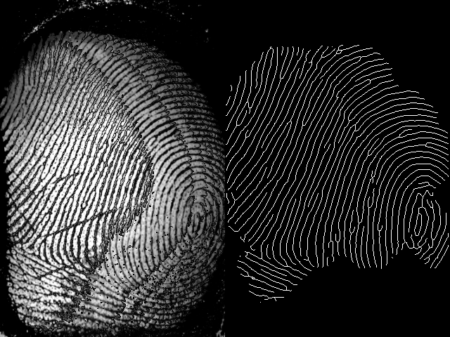
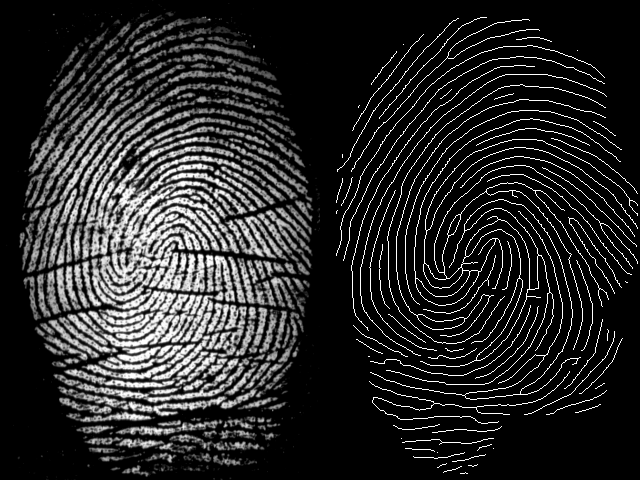

# 1. Summary

This repository consists of 3 modules:

- A fingerprint pre-processing chain based on image filtering algorithms
- An algorithm for extracting fingerprint’s features, which are called “minutiae”
- A one-to-one fingerprint matching algorithm. 

# 2. Dataset

The dataset used in this repository consists of 500 fingerprint images, each has the resolution of $320 \times 480$ pixels (Width $\times$ Height), white ridges & black background. You can see the dataset [here](https://drive.google.com/file/d/1kN5-_hYckyTowcTlNFRye7VB1JJX8z5a/view?usp=share_link).

# 3. Pre-processing module

The first module of this repository transforms a fingerprint image into its skeleton, using [Gabor Filter](https://en.wikipedia.org/wiki/Gabor_filter) and [Morphology Skeletonization](https://homepages.inf.ed.ac.uk/rbf/HIPR2/skeleton.htm). Here are some of its results:

|                                            |                                            |
|------------------------------------------- | ------------------------------------------ |
|  |  |
|  |  |
|  |  |
|  |  |

### Pipeline

The implemented pipeline is based on [this article](https://airccj.org/CSCP/vol7/csit76809.pdf). The following images show the steps in order, as well as the result of each step:

### Performance Status

In order to make the benchmark result accurate and reliable, the program is single-thread. The fingerprints will be processed one after another. There is no paralleled process.

- Processed 500 images: **56.599s**
- Average time per image: **0.1132s**
- Images per second: **8.83 img/s**

### Development Status

The Gabor Filter is not fully optimized. In fact, **80.35%** of the runtime is spent on a single step in the pipeline.

Documentation for this module will be composed later.

# 4. Feature Extraction Module

This module proposes a simple feature extraction algorithm. It takes a skeleton image of a fingerprint, then returns the *terminations* and *bifurcations*. It also comes with a little noise elimination, which increases the accuracy of the matching module.

|     |     |     |
| --- | --- | --- |
|  |  |  |

# 5. Matching Module

Algorithm: [Improving Fingerprint Verification Using Minutiae Triplets](https://doi.org/10.3390/s120303418).

### Benchmark Proposal

*To read more about the matching benchmark, see `_doc/`*

This benchmark uses the same dataset as the one in the **Pre-processing** section. The program is then challenged:

- Given $N$ fingerprints. For each fingerprint, find another one that is of a same finger.
- Because the project aims at fingerprint recognition, not fingerprint grouping, each comparison must be one-to-one. Thus, for this dataset, there are $500 \times 499$ comparisons expected.

Again, the program is single-thread, which ensures the average time for each comparison is accurate and reliable. Each comparison is performed one after another. There is no paralleled process.

### Benchmark - Accuracy

481 out of 500 given fingerprints successfully found an accurate match. That makes the accuracy of **96.2%**, or **3.8%** mismatch rate. Here are some of the matches:

|                                        |                                        |
| -------------------------------------- | -------------------------------------- |
|  |  |
|  |  |
|  |  |
|  |  |

### Benchmark - Performance

- Executed $500 \times 499 = 249500$ comparisons: $37.738$ s
- Average $0.1512 \times 10^{-3}$ s, or $0.1512$ ms per comparison
- Speed: $6611.37$ comparisons/s

Which sucks, tbh.

# 6. Directories

If you're really into the source code, here's the hierarchy:

- `./Algorithm`: Algorithms for general purposes.
- `./DataStructure`: Data Structures for general purposes.
- `./MatTool`: Classes that handle operations on matrices. Providing 2D Forward Loops, mathematic operators on matrices, matrix converters and more.
- `./Util`: Classes that are specialized in processing Fingerprint and Fingerprint only. Currently includes:
    - `./Util/Preprocessing`: Pre-process the input images into ridges' skeleton
    - `./Util/Singularity`: Extracts key points from fingerprint images
    - `./Util/Comparator`: Compare fingerprints
- `./_doc`: Document files

Regardless, this project's implementations and the algorithms behind them are **absolutely incomprehensible** to anyone without documentation (except me, ofc). Therefore, I'll try to write as many docs as I can to explain my code, I promise.
